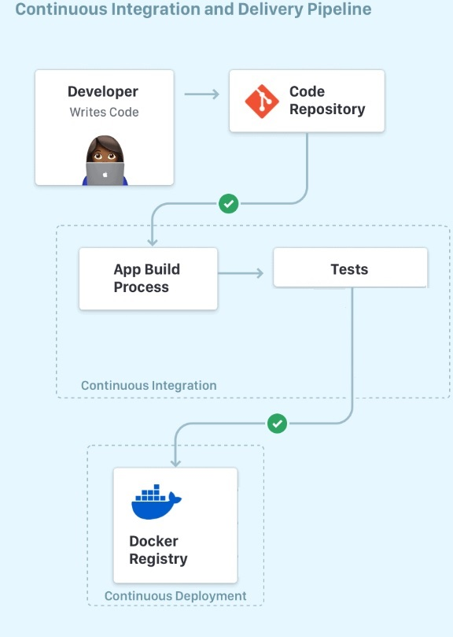

We will set up a CI/CD pipeline for a Java Gradle project. The project resides and is maintained in a Github repository. Anytime a new *push* or a *pull request* is made on the repo, the latest version of the project's code is compiled and built, tested againsted all the existing (unit) tests, and published as a docker image into [Docker Hub](https://hub.docker.com/). Along the way, we explore some exciting topics such as the use of secrets in GitHub Actions, running tests against the project's code and reporting code coverages, and conditional publishing to Docker Hub only if a certain coverage treshold is met. By the end of this tutorial you should have a fully automated GitHub Action pipleline that publishes your tested Java application as a container image to Docker Hub.

The following picture shows the main steps in the pipleline:



Anytime a developr pushes code to the repo the latest code is built, before the tests are run against it. Once all tests are exectued (and passed), we publish the latest build of the app (i.e. `JAR` file) as a docker image into Docker Hub.

:::caution IDE & Build Tools
The instructions that follow use Gradle & Intellij, but feel free to use an IDE/tools of your choice!
:::

## Create a Java Gradle Project
Create brand new Java Gradle project called **ci-helloworld**.

1. Under `src/main/java` folder, create a class named `ArrayUtils.java` with two methods:

```java
public class ArrayUtils {

     /**
     * Find last index of element
     *
     * @param x array to search
     * @param y value to look for
     * @return last index of y in x; -1 if absent
     * @throws NullPointerException if x is null
     */
    // test: x = [2, 3, 5]; y = 2; Expected = 0
    public static int findLast (int[] x, int y) {
        for (int i=x.length-1; i >= 0; i--) {
            if (x[i] == y) {
                return i;
            }
        }
        return -1;
    }

    /**
     * Count odd or positive elements
     *
     * @param x array to search
     * @return count of odd/positive values in x
     * @throws NullPointerException if x is null
     */
    // test: x = [-3, -2, 0, 1, 4]; Expected = 3
    public static int oddOrPos(int[] x) {
        int count = 0;
        for (int i = 0; i < x.length; i++) {
            if (x[i] % 2 != 0 || x[i] > 0) {
                count++;
            }
        }
        return count;
    }
}
```

Next, create a second class named `Main` which is where the `main` function resides:

```java
public class Main {
    public static void main(String[] args) {
        System.out.println("Main Executed!");
    }
}
```

The `main` function does not do much but we simply include it to have an entry point of execution for the project (if the project is ever executed!); The goal of our project is though to have a set of unit tests (see next step) run against the methods of `ArrayUtils` class.

2. Under `test/java` create a test class named `ArrayUtilsTest.java` with the following test methods:

```java
import org.junit.jupiter.api.Test;
import static org.junit.jupiter.api.Assertions.*;

public class ArrayUtilsTest {

    @Test
    public void testFindLastNull() {
        // Do not execute fault
        assertThrows(NullPointerException.class, () -> {ArrayUtils.findLast(null, 3);});
    }


    @Test
    public void testFindLastEmpty() {
        // For any input where y appears in the second or later position, there is no error. Also,
        // if x is empty, there is no error.
        assertEquals(-1, ArrayUtils.findLast(new int[]{}, 3));
    }

    @Test
    public void testFindLastNonExistent() {
        assertEquals(-1, ArrayUtils.findLast(new int[]{1, 2}, 3));
    }

    @Test
    public void testFindLastExistsFirstElement() {
        assertEquals(0, ArrayUtils.findLast(new int[]{2, 3, 5}, 2));
    }

    @Test
    public void testOddOrPosNull() {
        // Do not execute fault
        assertThrows(NullPointerException.class, () -> {ArrayUtils.oddOrPos(null);});
    }


    @Test
    public void testOddOrPosAllPositives() {
        // Any nonempty x with only non-negative elements works, because the first part of the
        // compound if-test is not necessary unless the value is negative.
        assertEquals(3, ArrayUtils.oddOrPos(new int[]{1, 2, 3}));
    }

    @Test
    public void testOddOrPositiveBothPositivesAndNegatives() {
        assertEquals(3, ArrayUtils.oddOrPos(new int[]{-3, -2, 0, 1, 4}));
    }
}
```

3. Next is `build.gradle`:

```groovy
plugins {
    id 'java'
    id 'jacoco'
}

group 'org.example'
version '1.0-SNAPSHOT'

repositories {
    mavenCentral()
}

dependencies {
    testImplementation 'org.junit.jupiter:junit-jupiter-api:5.8.1'
    testRuntimeOnly 'org.junit.jupiter:junit-jupiter-engine:5.8.1'
}

test {
    useJUnitPlatform()
}

jar {
    manifest {
        attributes 'Main-Class': 'Main'
    }
}

jacocoTestReport {
    dependsOn test
    reports {
        csv.required = true
    }
}

tasks.withType(Test) {
    testLogging {
        exceptionFormat "full"
        events "started", "skipped", "passed", "failed"
        showStandardStreams true
    }
}
```

This makes sure that both `JUnit` and `Jacoco` are imported into the project. It also has instructions on how to make a `JAR` file by specifying the "main" class of the prject (i.e., the class that contains the `main` function). Finally, it has instructions for printing each test case status on the standard output when the tests are executed. 

4. Last but not the least, `add`, `commit` and `push` the project to a Github repo named `ci-helloworld` on your Github account.
