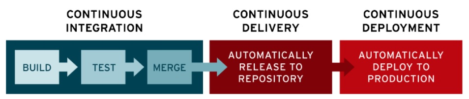

## Continuous Integration (CI)

Continuous integration is a software development practice where developers regularly merge their code changes into a central repository, after which automated builds and tests are run. Continuous integration most often refers to the build or integration stage of the software release process and entails both an automation component (e.g. a CI or build service) and a cultural component (e.g. learning to integrate frequently). The key goals of continuous integration are to find and address bugs quicker, improve software quality, and reduce the time it takes to validate and release new software updates.

## Why is Continuous Integration Needed?
In the past, developers on a team might work in isolation for an extended period of time and only merge their changes to the master branch once their work was completed. This made merging code changes difficult and time-consuming, and also resulted in bugs accumulating for a long time without correction. These factors made it harder to deliver updates to customers quickly.

## Continuous Integration, Continuous Delivery and Continuous Deployment
CI/CD is a method to frequently deliver apps to customers by introducing automation into the stages of app development. The main concepts attributed to CI/CD are continuous integration, continuous delivery, and continuous deployment. CI/CD is a solution to the problems integrating new code can cause for development and operations teams (AKA "integration hell").

Specifically, CI/CD introduces ongoing automation and continuous monitoring throughout the lifecycle of apps, from integration and testing phases to delivery and deployment. Taken together, these connected practices are often referred to as a "CI/CD pipeline" and are supported by development and operations teams working together in an agile way.

:::tip
The acronym CI/CD has a few different meanings. The "CI" in CI/CD always refers to continuous integration, which is an automation process for developers. Successful CI means new code changes to an app are regularly built, tested, and merged to a shared repository. It's a solution to the problem of having too many branches of an app in development at once that might conflict with each other.
:::

The "CD" in CI/CD refers to continuous delivery and/or continuous deployment, which are related concepts that sometimes get used interchangeably. Both are about automating further stages of the pipeline, but they're sometimes used separately to illustrate just how much automation is happening.

Continuous delivery usually means a developer's changes to an application are automatically bug tested and uploaded to a repository (like GitHub or a container registry), where they can then be deployed to a live production environment by the operations team. It's an answer to the problem of poor visibility and communication between dev and business teams. To that end, the purpose of continuous delivery is to ensure that it takes minimal effort to deploy new code.

Continuous deployment (the other possible "CD") can refer to automatically releasing a developer’s changes from the repository to production, where it is usable by customers. It addresses the problem of overloading operations teams with manual processes that slow down app delivery. It builds on the benefits of continuous delivery by automating the next stage in the pipeline.