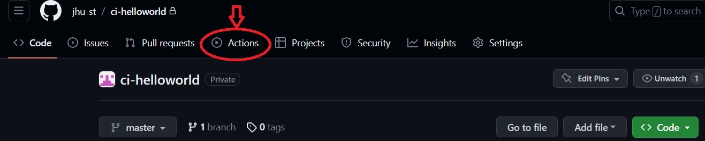
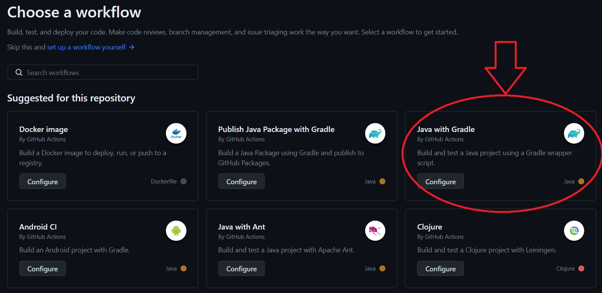
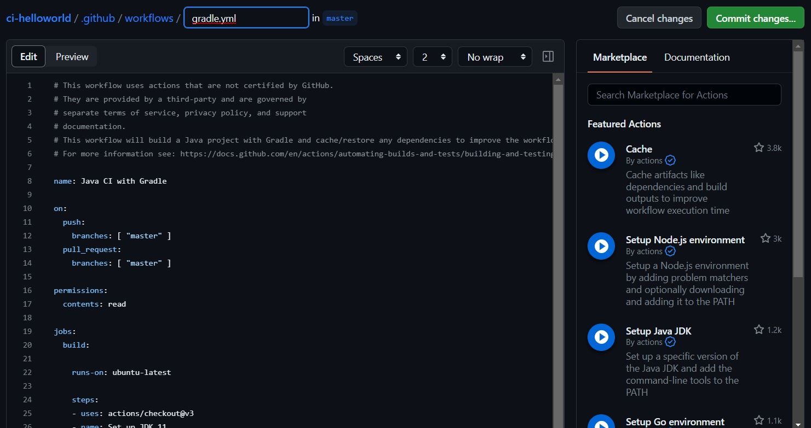
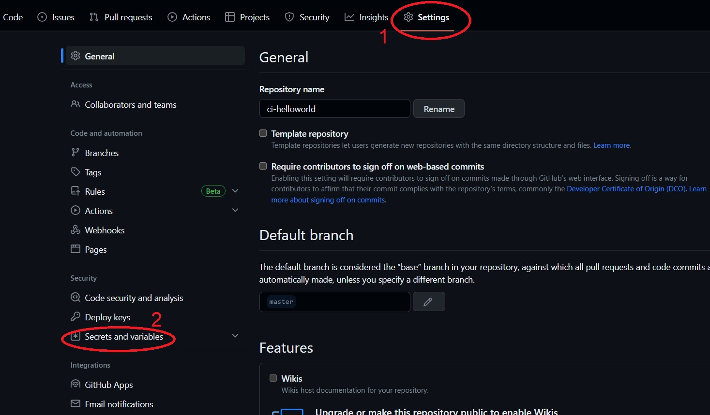
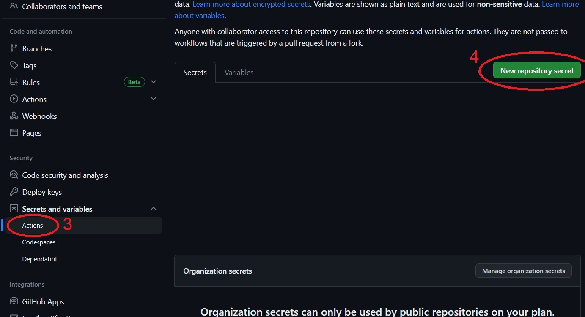

## Set Up the Pipeline

On Github, go to `Actions` tab:



This tab is home to [Github Actions](https://docs.github.com/en/actions/learn-github-actions/understanding-github-actions). 

:::tip GitHub Actions 
GitHub Actions is a continuous integration and continuous delivery (CI/CD) platform for your Github repository that allows you to automate your build, test, and deployment pipeline. You can create workflows (i.e., pipelines) that build and test every pull request to your repository, or deploy merged pull requests to production. GitHub provides Linux, Windows, and macOS virtual machines to run your workflows, or you can host your own self-hosted runners in your own data center or cloud infrastructure
:::

This is where we will create our workflow (i.e., pipeline) file. Github Actions makes some workflow suggestions based on what language(s)/technologies our project source code uses; you will likely see something like this:



Select "Java With Gradle".

:::info
Each suggested workflow pre-populates your workflow-setup file with some relevant instructions but we are going to write our own workflow file anyway, so it does not really matter which workflow suggestion you choose.
:::

This create a [YAML](https://www.redhat.com/en/topics/automation/what-is-yaml) file likely named `gradle.yml` under `.github/workflows/` path in the repo. This is where Github Action workflow config files are stored by default.



Now, copy & past the following content into the `gradle.yml` file:

:::danger Don't you worry!
Even though the workflow file may look scary at first, once you understand what is in it, you will most likely find it pretty straightforward actually, so don't get scared by the look of them!
:::

```yml
name: Java CI/CD with Gradle

on:
  push:
    branches: [ "master" ]
  pull_request:
    branches: [ "master" ]

  # permissions:
  # contents: read

jobs:
  build_and_test:
    name: Build and Test
    runs-on: ubuntu-latest

    steps:
      - uses: actions/checkout@v3
      - name: Set up JDK 11
        uses: actions/setup-java@v3
        with:
          java-version: '11'
          distribution: 'temurin'
      - name: Setting Permissions
        run: chmod a+x gradlew
      - name: Build with Gradle
        uses: gradle/gradle-build-action@67421db6bd0bf253fb4bd25b31ebb98943c375e1
        with:
          arguments: build
      - name: Test with Gradle
        uses: gradle/gradle-build-action@67421db6bd0bf253fb4bd25b31ebb98943c375e1
        with:
          arguments: test
      - name: Run Test Coverage
        run: ./gradlew jacocoTestReport
      - name: Jacoco
        uses: cicirello/jacoco-badge-generator@v2.9.0
        with:
          jacoco-csv-file: build/reports/jacoco/test/jacocoTestReport.csv
          fail-if-branches-less-than: 100

  build_and_publish_docker_image:
    name: Publish to Docker Hub
    runs-on: ubuntu-latest
    needs: [build_and_test]

    steps:
      - uses: actions/checkout@v3
      - name: Login to Docker Hub
        run: docker login -u ${{ secrets.DOCKER_USERNAME }} -p ${{ secrets.DOCKER_PASSWORD }}
      - name: Build Container image
        run: docker build -t ${{ secrets.DOCKER_REPO }}:latest .
      - name: Publish Docker image
        run: docker push ${{ secrets.DOCKER_REPO }}
```

1. ** Workflow Name and Trigger(s)**: This first part gives this workflow the name of "Java CI with Gradle" and the `on` command specifies that this workflow will run whenever either a new `push` or `pull request` is made on the `master` branch of `ci-helloworld` repo.

```
name: Java CI with Gradle

on:
  push:
    branches: [ "master" ]
  pull_request:
    branches: [ "master" ]
```

2. Next, we have the jobs  that are part of this workflow. There are two main jobs namely "build_and_test" and "build_and_publish_docker_image":

    * 2.1. **"build_and_test":** here, we first formulate how to build (compilation and packaging instructions) the project:

    ```
    build_and_test:
    name: Build and Test
    runs-on: ubuntu-latest

    steps:
      - uses: actions/checkout@v3
      - name: Set up JDK 11
        uses: actions/setup-java@v3
        with:
          java-version: '11'
          distribution: 'temurin'
      - name: Setting Permissions
        run: chmod a+x gradlew
      - name: Build with Gradle
        uses: gradle/gradle-build-action@67421db6bd0bf253fb4bd25b31ebb98943c375e1
        with:
          arguments: build
      - name: Test with Gradle
        uses: gradle/gradle-build-action@67421db6bd0bf253fb4bd25b31ebb98943c375e1
        with:
          arguments: test
      - name: Run Test Coverage
        run: ./gradlew jacocoTestReport
      - name: Jacoco
        uses: cicirello/jacoco-badge-generator@v2.9.0
        with:
          jacoco-csv-file: build/reports/jacoco/test/jacocoTestReport.csv
          fail-if-branches-less-than: 100
    ```

    `runs-n` specifies that the following commands will be run an ubuntu machine. 
    
    2.1.a. **"actions/checkout@v3"**: This is a popular "Action" that is used to checkout the latest version of the project code from the repo.

    :::tip Actions & Marketplace
    GitHub Marketplace is where you can share your apps and actions publicly with all GitHub users. GitHub Marketplace connects you to developers who want to extend and improve their GitHub workflows. You can list free and paid tools for developers to use in GitHub Marketplace. Anytime you want to accomplish a step in your workflow, chances are there is already an "Action" available through the Marketplac that you can just grab and use without the need to re-invent the wheel!
    :::

    2.1.b. **actions/setup-java@v3**: This action facilitates compilation of the java project code which was checked out in the previous step. The Java version is set to 11 here.

    2.1.c. **"Setting Permissions":** `chmod` linux command is used to make sure the `gradlew` script is executable.

    2.1.d. build with **gradle/gradle-build-action@67421db6bd0bf253fb4bd25b31ebb98943c375e1**: Using this action, we build our Java gradle project. This has the same effect as running the command `gradlew build`.
    
    2.1.e. test with **gradle/gradle-build-action@67421db6bd0bf253fb4bd25b31ebb98943c375e1**: Next, we use the same action this time to run the tests. This step is the step that runs all the unit tests in the `ArrayUtilsTest.java` file. If any of the tests fail, the workflow is interrupted at this step and no further steps will be tried. 
    
    :::danger All Tests Must Pass
    This step effectively makes sure that in orde to get to the netx steps of this workflow, there must be NO failing test cases, hence preventing deploying/delivering "faulty" code into production stages.
    :::

    2.1.f. **"Run Test Coverage"**: This step runs the command `./gradlew jacocoTestReport` effectively running Jacoco to produce code coverage report(s).

    2.1.g. **cicirello/jacoco-badge-generator@v2.9.0**: With the help of this action found on the Marketplace, we can analyze the generated reports and set minimum required thresholds for different coverage criteria. In our case, we set `80%` branch coverage (BC) minimum requirement. If the test cases achieve anything less than `80%` BC on the project source code, the workflow is interrupted.

    2.2 **build_and_publish_docker_image:** The overall goal in this job is to publish the code to [Docker hub](https://hub.docker.com/) as a container image. We again choose to run the steps on latest version of `ubuntu`. We also specify that this job need successful execution & completion of the `build_and_test` job.

    ```
    build_and_publish_docker_image:
    name: Publish to Docker Hub
    runs-on: ubuntu-latest
    needs: [build_and_test]
  
  
    steps:
      - uses: actions/checkout@v3
      - name: Login to Docker Hub
        run: docker login -u ${{ secrets.DOCKER_USERNAME }} -p ${{ secrets.DOCKER_PASSWORD }}
      - name: Build Container image
        run: docker build -t ${{ secrets.DOCKER_REPO }}:latest .
      - name: Publish Docker image
        run: docker push ${{ secrets.DOCKER_REPO }}
    ```

    2.2.a. **actions/checkout@v3:** check out the latest version of the ci-helloworld source code.

    2.2.b **Login to Docker Hub:** In order to create a [container image](https://www.docker.com/resources/what-container/) and publish it to docker hub, we need to login using the command `docker login -u ${{ secrets.DOCKER_USERNAME }} -p ${{ secrets.DOCKER_PASSWORD }}`:

    :::info Github Secrets
    Github secrets are encrypted environment variables that can be injected into your actions. A secret can not be seen once it have been created and they remain encrypted until they are used in a workflow. But even when they are used in a workflow they cannot be seen in the action logs since they are blurred out. They are thus suitable to be used to store sensitive information such as passwords and keys.
    :::

    :::info Create Github Secrets
    First, if you do not have a docker hub account, go [https://hub.docker.com/](https://hub.docker.com/) and create one for free. Then, on Github, in the main page of your repo, go to `Settings` tab, then click on `Secrets and variables` in the left menu:

    

    Next Click on `Actions` and using the `New repository secret` create three separate secrets:
    1. DOCKER_PASSWORD with value of whatever your docker hub password is.
    2. DOCKER_USERNAME with value of whatever your docker hub username is.
    3. DOCKER_REPO with value of `docker_hub_user/ci-helloworld` where `docker_hub_user` is your docker hub username.

    
    :::

    :::tip Docker and Container Image
    Docker is an open-source software designed to facilitate and simplify application development. It is a set of platform-as-a-service products that create isolated virtualized environments for building, deploying, and testing applications.    
    A Docker container image is a lightweight, standalone, executable package of software that includes *everything* needed to run an application: source code, dependencies, libraries, runtime, system tools, system libraries and settings.
    :::

    2.2.c. **Build Container image:** This step builds the image using the docker command `docker build -t ${{ secrets.DOCKER_REPO }}:latest` where ${{ secrets.DOCKER_REPO }} is replaced by the secret's value you created in the previous step. `:latest` gives a tagname to this image called "latest" (i.e., the latest build of the image)

    2.2.d. **Publish Docker image:** This is the very last step of the `build_and_publish_docker_image` job as well as the last step of the our entire workflow!

    **YAYYYY!!! Congrats! You made it all the way to the end!**


