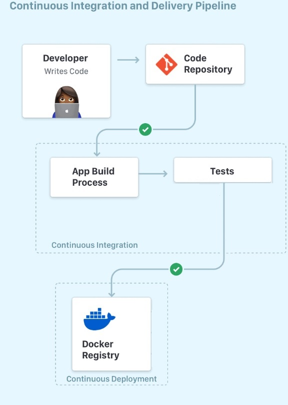

We will set up a CI/CD pipeline for a Java Gradle project. The project resides and is maintained in a Github repository. Anytime a new *push* or a *pull request* is made on the repo, the latest version of the project's code is compiled and built, tested againsted all the existing (unit) tests, and published as a docker image into [Docker Hub](https://hub.docker.com/). Along the way, we explore more exciting topics such as the use of secrets in GitHub Actions, running tests against the project's code and reporting code coverages external, and conditional publishing to Docker Hub only if a certain branch coverage treshold is met. By the end of this tutorial you should have a fully automated GitHub Action pipleline that publishes your tested Java application as a container image to Docker Hub.

The following picture shows the main steps in the pipleline:

:::caution IDE & Build Tools
The instructions that follow use Gradle & Intellij, but feel free to use your IDE/tools of your choice!
:::

## Create a Java Gradle Project
Create brand new Java Gradle project called **ci-helloworld**. Under `src/main/java` folder, create a class named `ArrayUtils.java` with the following content.