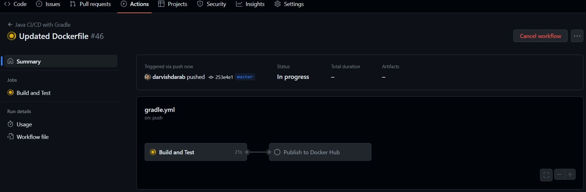
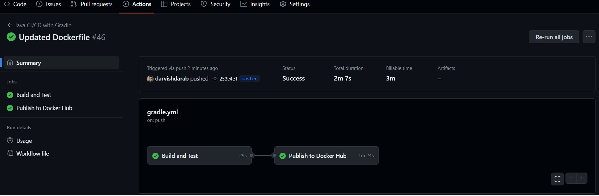
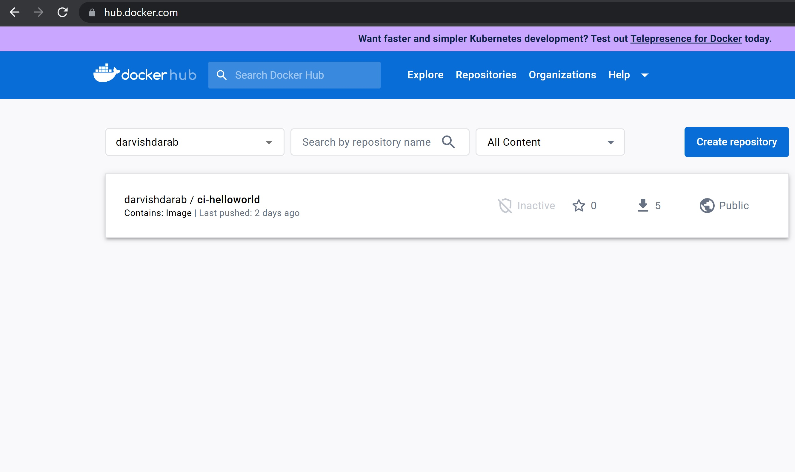

Now that everything is in place, anytime you make a new push to the repo, immediately go to `Actions` tab to see the live progress of your workflow. If things go as expected, the workflow must finish successfully.

### Workflow running:

### Workflow finished

### Container image published

### Note
:::danger code coverage treshold
Note that in `gradle.yml` we set the branch coverage treshold to `100%` and the workflow still succeeded since, well, the tests in `ArrayUtilsTest.java` indeed acheive `100%` BC on the methods of `ArrayUtils` class. But in reality, you likely need to adjust this number since it is rarely possible to achieve complete BC.
:::

