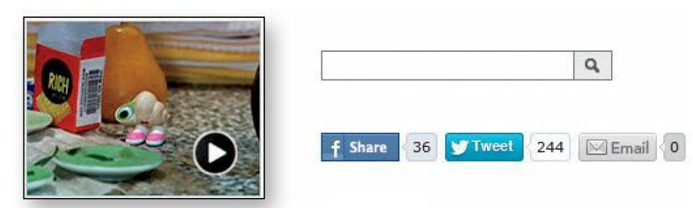
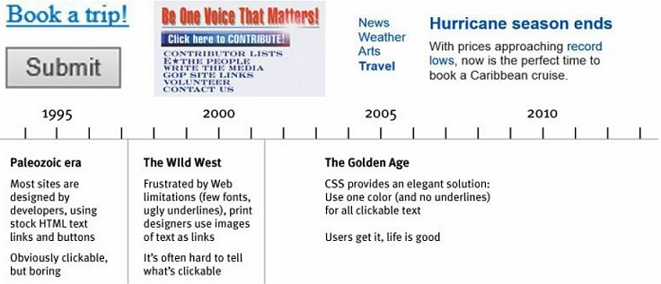
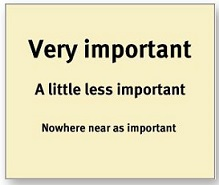
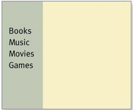
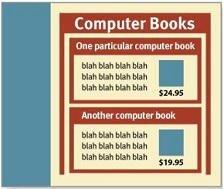
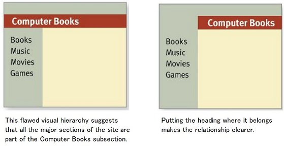
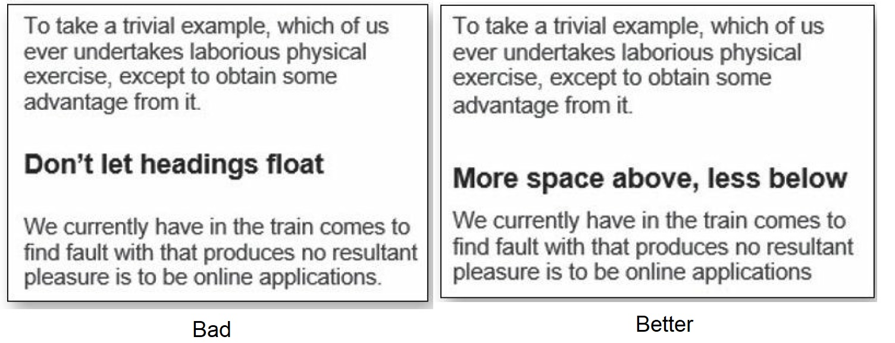

Faced with the fact that your users are whizzing by, there are some important things you can do:

* Take advantage of conventions
* Create effective visual hierarchies
* Break pages up into clearly defined areas
* Make it obvious what’s clickable

## Design basics

One of the best ways to make almost anything easier to grasp in a hurry is to
follow the existing conventions — the widely used or standardized design
patterns. 
In the past twenty years, many conventions for Web pages have evolved. As
users, we've come to have a lot of expectations about
* **Where things will be located on a page.** For example, users expect
the logo identifying the site to be in the top-left corner (at least in
countries where reading is left-to-right) and the primary navigation to
be across the top or down the left side.

* **How things work.** For example, almost all sites that sell products use
the metaphor of a shopping cart and a very similar series of forms for
specifying things like your method of payment, your shipping address,
and so on.

* **How things look.** Many elements have a standardized appearance, like
the icon that tells you it's a link to a video, the search icon, and the
social networking sharing options.

Here are the most prominent web design fundamentals to adhere to:

### Logo Placement
Logos are typically placed on the upper left of the page (in left-to-right languages such as English).

### Main Navigation
The Main Navigation should appear in a bar across the top of your site, either to the right of the logo or below the logo. 

:::caution Less is more 
Number of pages included in the main navigation is important. Anywhere from 5-7 pages in the first level of navigation and no more than 3 levels for sub navigation is recommended.
:::

### Break up pages into clearly defined areas
Dividing the page into clearly defined areas is important because it allows
users to decide quickly which areas of the page to focus on and which areas
they can safely ignore. 

:::info
Eye-tracking studies of Web page scanning suggest that users decide very quickly in their initial glances which parts of the page are likely to have useful information and then rarely look at the other parts — almost as though they weren't there (Banner blindness—the ability of users to completely ignore areas they think will contain ads—is just the extreme case.)
:::

### Link Styling
Clicking links has become second nature for web users. Users should be able to know instinctively what's clickable and what isn't. So, always "make it obvious what’s clickable".

:::tip
In general, you’ll be fine if you just stick to one color for all text links or
make sure that their shape and location identify them as clickable. Just don’t
make silly mistakes like using the same color for links and nonclickable
headings.
:::

### Buttons
Buttons should also follow website conventions. They should have some sort of background and hover effect. The background color is typically the same color as the link text or a secondary color. *Buttons should be used for more important calls to action* whereas link text can be used within paragraphs of information.

### Colors
Colors should be determined based on your company's brand standards. But if your company does not have brand standards then we recommend using 2-3 colors and 1-3 neutrals (white, black, gray). If you need more color then use tints and shades of the colors already chosen. This is an important website convention because it keeps your website cohesive and connects your branding on and off the web.

### Standard Icons
Icon conventions are particularly useful because they provide a clear explanation without words. An envelope icon signifies email, a shopping cart or bag icon signifies the checkout page, and social media icons signify social sharing. But icons only work if they are common enough that no explanation is necessary. 

### Content Hierarchy
Website conventions for website content is to create a content hierarchy. This means that content should be made up of headings and paragraphs. Heading One should be used only once and the highest up on the page. Pages with a clear visual hierarchy have three traits:

1. **The more important something is, the more prominent it is.** The most important elements are either larger, bolder, in a distinctive color, set off by more white space, or nearer the top of the page—or some combination of the above.

2. **Things that are related logically are related visually.** For instance,
you can show that things are similar by grouping them together under a heading, displaying them in the same visual style, or putting them all in a clearly defined area.

3. **Things are "nested" visually to show what's part of what.** For instance, a site section name ("Computer Books") would appear above the titles of the individual books, reflecting the fact that the books are part of the section. And each book title in turn would span all the elements that make up the description of that book.

Another example:

### More rules to go by

:::danger Two more important rules to go by
* **A note on creativity:** with so many companies competing for attention on the web, it’s important to use creativity to stand out. But all too often, creativity sacrifices clarity. The rule to remember is ***Clarity trumps Creativity***.
* **Format text to support scanning:** 1) Keep your paragraphs short. 2) Highlight key terms. 3) Use bullted lists. 4) Don't let headings float; make sure they are closer to the section they introduce.
:::
