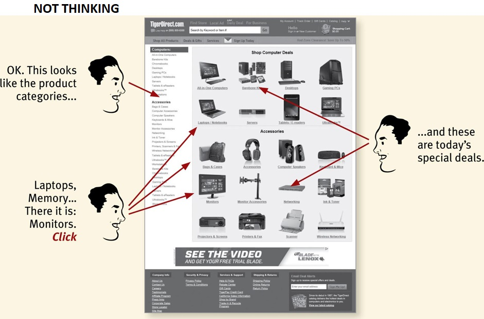
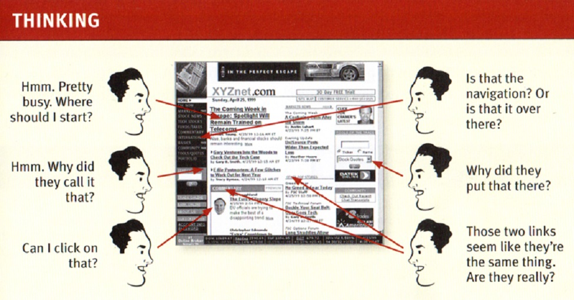
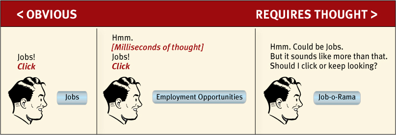
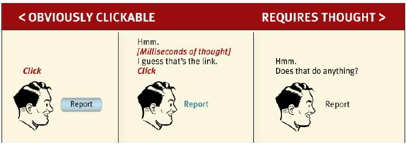
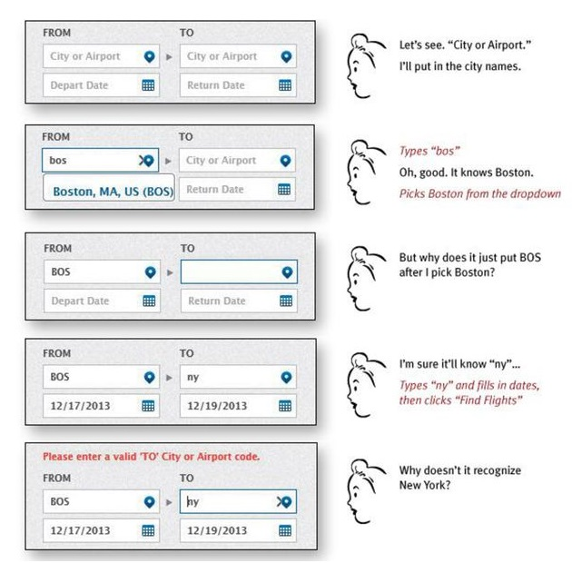
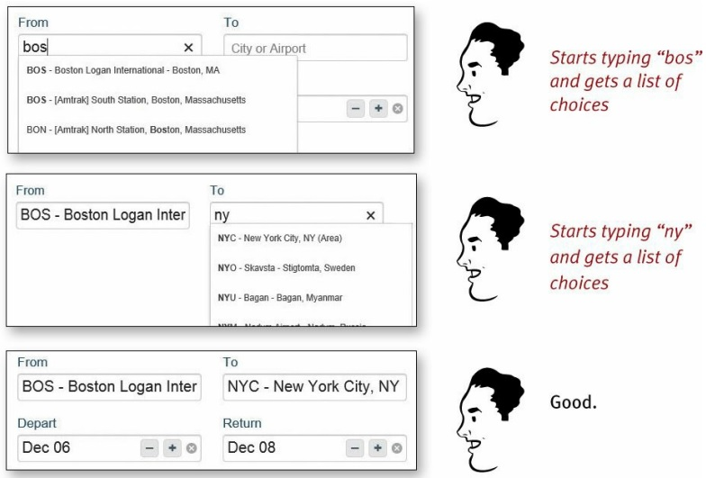

Question: What is the most important thing I should do to make sure my website or app is easy to use?
Answer: When I look at a wespage or mobile app view, it should be self-evident. Obvious. Self-explanatory. I should be able to "get it" without spending too much time and/or energy on it! 

:::tip
The point is every question mark in our mind when interacting with a product (site, app, etc.) adds to our cognitive workload, distracting our attention from the task at hand. The distractions may be slight, but they add up, especially if it is something we do all the time like finding the next thing to click on!
:::

Self-evident means your next door neighbor who has no interest in the subject of your site/app, who barely knows how to use a browser's back button, could look at your Home page and say: "Oh, it's a ...", "Yeah, here I go to do ...", "I see, that is where I go for ..., huh pretty simple!", etc.

## Things that make us think

### Names/Titles
Names and titles used in the site/app must be as simple and self-explanatory as possible. Here is an example:

### Links and Buttons
As a user, I should never have to devote a mili-second of thought to whether things are clickable or not.

## Another example: Booking a flight

Most of the chatter listed below happens in a fraction of second in my mind but you can see that it is a pretty noisy process:

But, another site just takes what I type and gives me choices that make sense:

No question marks, not mental chatter, and no errors!

:::tip
There are many things user should not think about:
* where am I?
* where should I begin?
* where did they put ...?
* why did they call it that?
* Is that an ad or part of the page?
* what are the most important things on this page?
* etc

The most important thing in usability is to understand the *principle of eliminating the question marks*
:::

## Why is all of this so important?

The answer is simple. They say: "On the internet, the competition is always one click away, so if you frustrate users they will head somewhere else."

