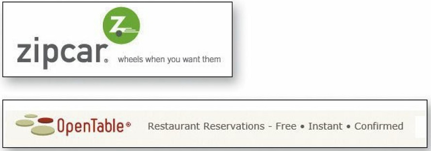
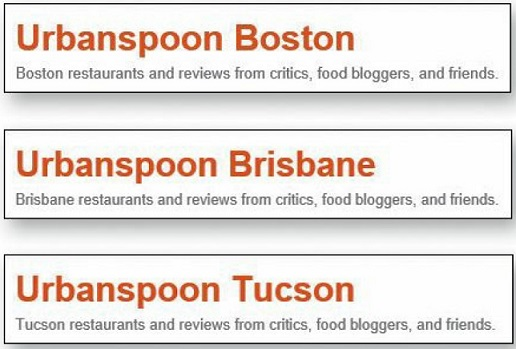

Homepage of each website is typically by far the most visited page and oftentimes the first place your users land when they come to your wbsite (for the first time.) Thus, it is crucial to get them off on the right foot. 

:::tip Bing Bang Theory
This is called the Big Bang Theory of Web Design because like the Big Bang Theory, it’s based on the idea that the first few seconds you spend on a new Web site or Web page are critical. 
:::

Everything on the Home page can contribute to our understanding of what the site is. Nothing beats a good **tagline** for this purpose. 

## Tagline
A tagline is the space right next to the Site ID containing a phrase that's visually connected to the ID. A tagline is a pitchy phrase that characterizes the whole enterprise, summing up what it is and what makes it great. Taglines have been around for a long time in advertising, entertainment, and publishing: "Thousands of cars at
impossibly low prices", "More stars than there are in the heavens" Metro-Golden-Mayer studios), and "All the News That's Fit to Print" (The New York Times) for example.

1. Good tagelines are **clear and informative**.

2. Good taglines are just **long enough, but not too long**. Six to eight words seem to be long enough to convey a full thought, but short enough to absorb easily.

3. Good taglines convey **differentiation** and a clear benefit. [Jakob Nielsen](https://www.nngroup.com/people/jakob-nielsen/) has suggested that a really good tagline is one that no one else in the world could use except you. 

4. Bad taglines sound **generic**.

:::caution Tagline vs Motto
Don’t confuse a tagline with a motto, like "We bring good things to life," "You're in good hands," or "To protect and to serve." A motto expresses a guiding principle, a goal, or an ideal, but a tagline conveys a value proposition. Mottoes are lofty and reassuring, but if I don't know what the thing is, a motto isn’t going to tell me.
:::

## Where to start
Once I know what I’m looking at, there's still one more important question that the Homepage has to answer for me. When I enter a new site, after a quick look around the Homepage I should be able to say with confidence:

* Here's where to start if I want to search.
* Here's where to start if I want to browse.
* Here's where to start if I want to sample their best stuff.

:::caution Where to start
On sites that are built around a step-by-step process (applying for a mortgage,
for instance), the entry point for the "start" process should leap out at me. And on
sites where I have to register if I'm a new user or sign in if I'm a returning
user, the places where I register or sign in should be prominent.
:::