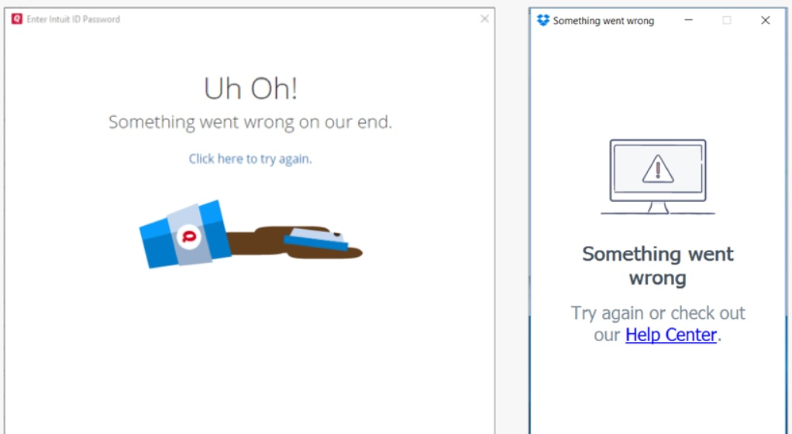

In this part, we delve into more usability principles:

## Consistency

Remember the double-D rule: differences are difficult. When users have expectations for how something will behave or where they can access it, deviations from those expectations cause confusion, frustration, and increased cognitive load as people attempt to puzzle out the problem. Human minds crave consistency.

There are a few types of inconsistency that are especially common in complex applications and cause even seasoned users to be utterly confused:

* Different words or commands for the same action
* Placing controls for the same feature in many different places
* Controls that seem similar to one another (from the user’s point of view) but are  accessed in different places (e.g. one is accessed in a toolbar, another a menu, and a third deep in a Preferences dialog)
* Similar workflow patterns which require interacting with very different sections of the interface
* Inconsistent rules for legit input data: sometimes an entry is allowed, and at other times it’s marked as invalid, without any feedback as to why this is happening
* A feature is sometimes available, and sometimes not for mysterious reasons that are not made explicit
* UI elements or controls that move around, violating spatial consistency

## Error Messages
Error messages are a special form of feedback: they tell users that something has gone wrong. We've known the guidelines for error messages for almost 30 years, and yet many applications still violate them. 

The most common guideline violation is when an error message simply says something is wrong, without explaining why and how the user can fix the problem. Such messages leave users stranded.

:::info
Informative error messages not only help users fix their current problems, but they can also serve as a teachable moment. Although people won't invest time in reading and learning about your app’s features, they will make the effort to understand an error situation if you explain it clearly, because they want to overcome the error.
:::

:::tip
Here is a great read to learn further about designing error messages:
* [https://www.nngroup.com/articles/error-message-guidelines/](https://www.nngroup.com/articles/error-message-guidelines/)
:::

## Default Values

Defaults help users in many ways. Most importantly, defaults can:

* speed up the interaction by freeing users from having to specify a value if the default is acceptable
* teach by providing an example of the type of answer that is appropriate for the question
* direct novice users toward a safe or common outcome, by letting them accept the default if they don't know what else to do

Default values can save significant user effort in repetitive tasks, such as filling in the same form many times. Identifying key values for form fields can increase productivity and reduce frustration. Your analytics can help you understand if there is a most commonly chosen option for a specific field.

## Enough Distance Between Destructive and Confirmation Actions

Placing actions such as Save next to actions that destroy work such as Discard is a commonplace design decision that causes much grief for users. While logically this placement often makes sense (for example, Save and Delete are related, in that they decide the fate of an item), it also makes it easy to click the wrong button or icon — especially when users are rushing, completing repetitive actions, or have motor difficulties.

