:::danger It’s a fact
People won’t use your Web site if they can’t find their way around it.
:::

Picture this: It’s Saturday afternoon and you're headed for the mall to buy a
chainsaw.
As you walk through the door at Home Depot, you’re thinking, "Hmmm. Where do
they keep chainsaws?" As soon as you’re inside, you start looking at the
department names, high up on the walls. (They’re big enough that you can
read them from all the way across the store.)

"Hmmm," you think, "Tools? Or Lawn and Garden?" It could be either one,
but you’ve got to start somewhere so you head in the direction of Tools.
When you reach the Tools department, you start looking at the signs at the
end of each aisle.

When you think you’ve got the right aisle, you start looking at the individual
products. If it turns out you’ve guessed wrong, you try another aisle, or you may back
up and start over again in the Lawn and Garden department, or you may just start by asking a clerk when entering a store.

In many ways, you go through the same process when you enter a Web site. 

* You're usually trying to find something.
* You decide whether to ask first or browse first: some people are "search-dominant" users who will almost always look for a search box (i.e., asking a clerk) while some others "link-dominant" users will almost always browse first, searching only when they've run out of likely links to click or when they have gotten sufficiently frustrated by the site. But, for many many people the decision whether to start by browsing or searching depends on their current frame of mind, how much of a hurry they're in, and whether the site appears to have decent browsable navigation. 

This all shows the importance of proper navigation system built within your website.

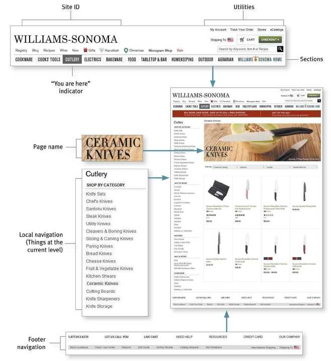

Here are the most important website navigation interface design principles:

## Persistent Navigation
Web designers use the term persistent navigation (or global navigation) to
describe the set of navigation elements that appear on every page of a site.

:::info
Just having the navigation appear in the same place on every page with a
consistent look gives you instant confirmation that you’re still in the same
site—which is more important than you might think. And keeping it the same
throughout the site means that (hopefully) you only have to figure out how it
works once.
:::

:::tip
There is one exception to the above rule: *forms*. For instance, when I'm paying for
my purchases on an e-commerce site, you don’t really want me to do anything but finish filling in the forms. The same is true when I'm registering, subscribing, giving feedback etc. 
:::

Persistent navigation should include the four elements you most need to have
on hand at all times:

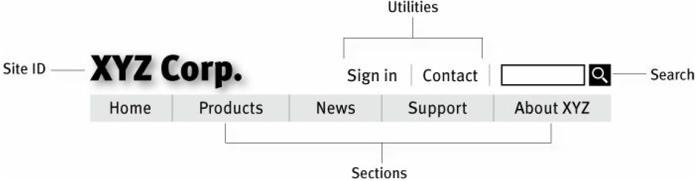

## Site ID

The Site ID or logo is like the building name for a Web site. At Home Depot, I really
only need to see the name on my way in; once I'm inside, I know I'm still in
Home Depot until I leave. But on the Web — where my primary mode of travel is
teleportation — I need to see it on every page.

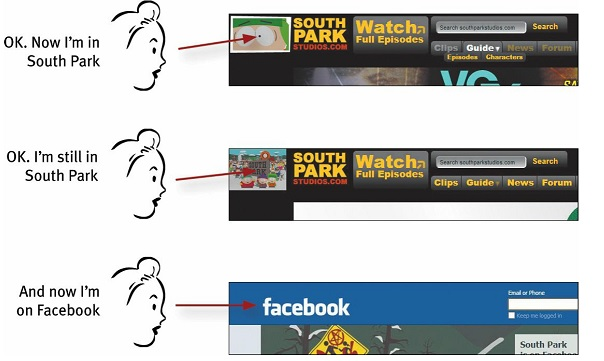

As mentioned [before](basics), the Site ID/logo mus appear on the top left corner of the page. In addition to that, the Site ID also needs to look like a Site ID. This means it should have the attributes we would expect to see in a brand logo or the sign outside a store: a distinctive typeface and a graphic that's recognizable at any size from a button to a billboard.

## The Sections

The Sections—sometimes called the primary navigation—are the links to the
main sections of the site: the top level of the site's hierarchy.

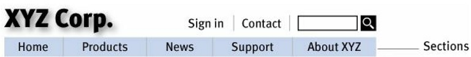

In some designs the persistent navigation will also include space to display
the secondary navigation: the list of subsections in the current section.

In others, pointing at a section name or clicking on it reveals a dropdown
menu. And in others, clicking takes you to the front page of the section,
where you’ll find the secondary navigation.

## The Utilities
Utilities are the links to important elements of the site that aren't really part
of the content hierarchy. These are things that either can help me use the site (like Sign in/Register, Help, a Site Map, or a Shopping Cart) or provide information about its publisher (like About Us and Contact Us). 

Utilities will vary for different types of sites. For a corporate or e-commerce
site, for example, they might many items such as About Us, Archives, Checkout, Company Info, Contact Us, Customer Service, Discussion Boards, Downloads, 
Directory, Forums, FAQs, Help, Investor Relations, How to Shop, Jobs etc.

:::caution
As a rule, the persistent navigation can accommodate only four or five
Utilities. The less frequently used leftovers belong in the footer: the small text links at the bottom of each page.
:::

## Search
Given the power of searching and the number of people who prefer searching
to browsing, unless a site is very small and very well organized, every page
should have either a search box or a link to a search page. Your search functionality appearance must match something out of one of these three patterns:

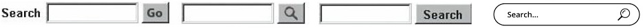

:::tip
If there is any possibility of confusion about the scope of the search (what's being searched: the site, part of the site, or the whole Web), by all means spell it out.

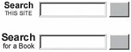
:::

## Page Names
There are four things you need to know about page names:

1. Every page needs a name. Just as every corner should have a street sign, every page should have a name.
2. The name needs to be in the right place. In the visual hierarchy of the page, the page name should appear to be framing the content that is unique to this page.

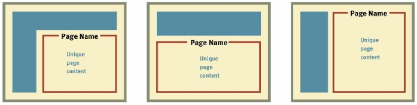

3. The name needs to be prominent. You want the combination of position, size, color, and typeface to make the name say "This is the heading for the entire page."

4. The name needs to match what I clicked. Even though nobody ever
mentions it, every site makes an implicit social contract with its
visitors: ***The name of the page will match the words I clicked to get there.***

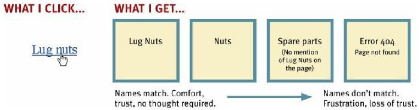

## "You are here" Indicator

On the Web, this is accomplished by highlighting my current location in
whatever navigation bars, lists, or menus appear on the page.

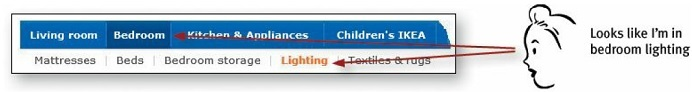

There are a number of ways to do this:

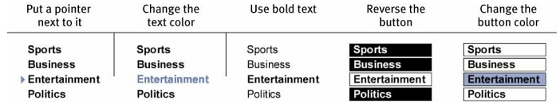

## Breadcrumbs
Like “You are here” indicators, Breadcrumbs show you where you are.

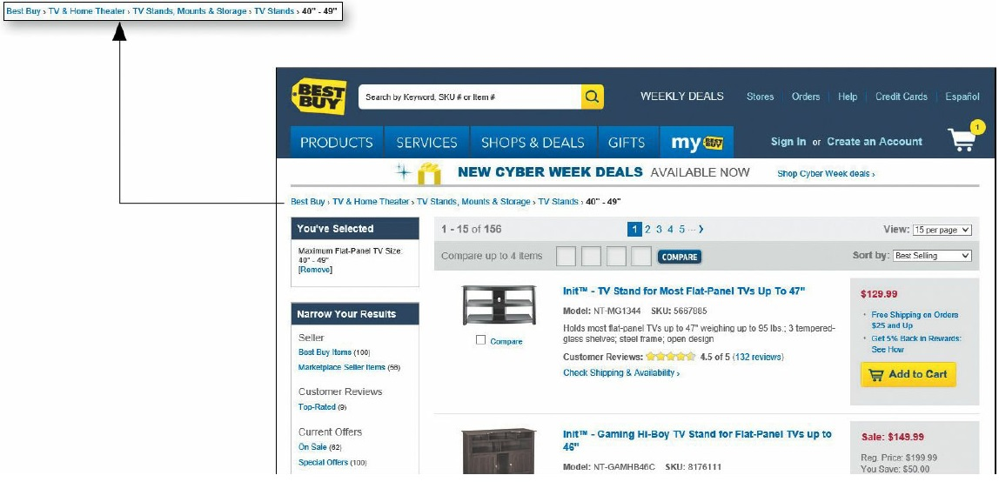

:::tip Breadcrumbs Naming
They’re called Breadcrumbs because they’re reminiscent of the trail of
crumbs Hansel dropped in the woods so he and Gretel could find their way
back home
:::

## Tabs
Tabs are one of the very few cases where using a physical metaphor in a user
interface actually works. Like the tab dividers in a three-ring binder or tabs
on folders in a file drawer. Tabs make an excellent navigation choice, but make sure you get them right. The active tab needs to be a different color or contrasting shade, and it has to physically connect with the space below it.

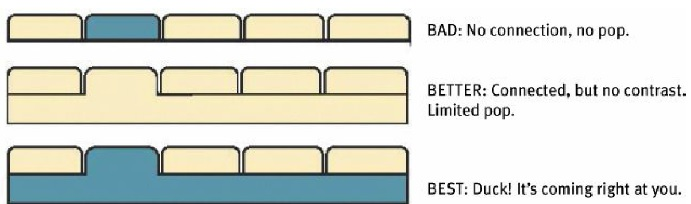

## Last but not the Least

Here is your checklist questions for good Web navigation design:

:::danger Acid test for good web navigation
***Imagine that you’ve been blindfolded and locked in the trunk of a car, then
driven around for a while and dumped on a page somewhere deep in the bowels of a Web site. If the page is well designed, when your vision clears you should be able to answer the following 6 questions without hesitation:***
1. What site is this? (Site ID)
1. What page am I on? (Page name)
1. What are the major sections of this site? (Sections)
1. What are my options at this level? (Local navigation)
1. Where am I in the scheme of things? (“You are here” indicators)
1. How can I search?
:::

