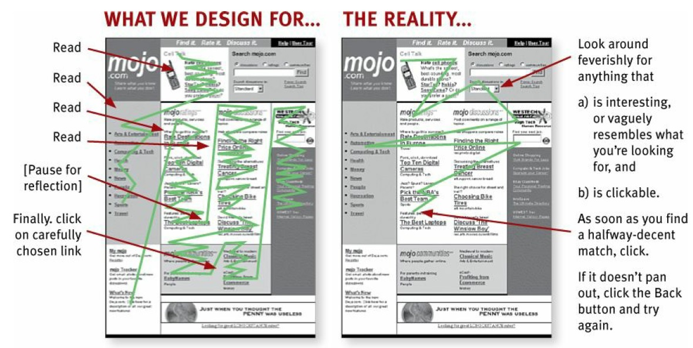
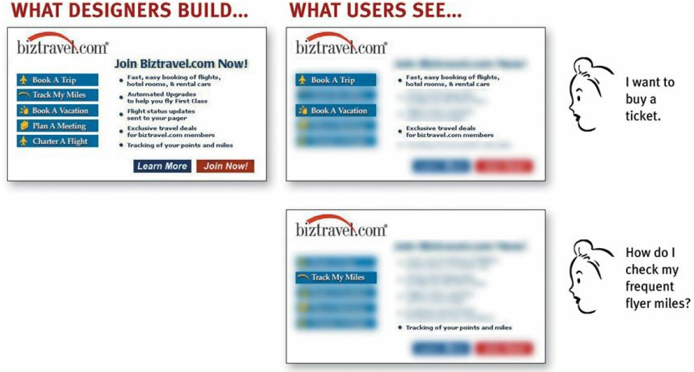

When we’re creating sites, we act as though people are going to pore over
each page, reading all of our carefully crafted text, figuring out how we’ve
organized things, and weighing their options before deciding which link to
click.

What they actually do most of the time (if we’re lucky) is *glance* at each new
page, scan some of the text, and *click on the first link that catches their
interest or vaguely resembles the thing they’re looking for*. There are almost
always large parts of the page that they don’t even look at.

**We’re thinking "great literature" (or at least "product brochure"), while the
user’s reality is much closer to "billboard going by at 60 miles an hour."**

## Fact #1: We don't read, we scan!
The exception, of course, is pages that contain documents like news stories,
reports, or product descriptions, where people will revert to reading—but
even then, we are often alternating between reading and scanning.

Why do we scan:
1. **We are usually on a mission.** Most Web use involves trying to get
something done, and usually done quickly. As a result, Web users tend
to act like sharks: They have to keep moving, or they’ll die. We just
don’t have the time to read any more than necessary.

1. **We know we don’t need to read everything.** On most pages, we’re
really only interested in a fraction of what’s on the page. We’re just
looking for the bits that match our interests or the task at hand, and the
rest of it is irrelevant. Scanning is how we find the relevant bits.

1. **We’re good at it.** It’s a basic skill: When you learn to read, you also
learn to scan. We’ve been scanning newspapers, magazines, and books
—or if you’re under 25, probably reddit, Tumblr, or Facebook—all our
lives to find the parts we’re interested in, and we know that it works.

:::tip
The net effect is a lot like Gary Larson’s classic Far Side cartoon about the
difference between what we say to dogs and what they hear. In the cartoon,
the dog (named Ginger) appears to be listening intently as her owner gives
her a serious talking-to about staying out of the garbage. But from the dog’s
point of view, all he’s saying is "blah blah GINGER blah blah blah blah
GINGER blah blah blah." **Like Ginger, we tend to focus on words and phrases that seem to match (a) the task at hand or (b) our current or ongoing personal interests. And of course, (c) the trigger words that are hardwired into our nervous systems, like
"Free", "Sale", our own name, etc.**
:::

## Fact #2: We don’t make optimal choices. We satisfice.
When we’re designing pages, we tend to assume that users will scan the page,
consider all of the available options, and choose the best one.

In reality, though, most of the time we don’t choose the best option—we
choose the first reasonable option, a strategy known as satisficing.1 As soon
as we find a link that seems like it might lead to what we’re looking for,
there’s a very good chance that we’ll click it.

Why don't Web users look for the best choice?
1. We’re usually in a hurry. "Optimizing is hard, and it takes a long time. Satisficing is more efficient."

1. There's not much of a penalty for guessing wrong. The penalty for guessing wrong on a Web site is usually only a click or two of the "Back" button, making satisficing an effective strategy. (Back is the most-used button in Web browsers!)

1. Weighing options may not improve our chances. On poorly designed sites, putting effort into making the best choice doesn't really help. You're usually just as well off going with your first guess and using the "Back" button if it doesn't work out.

1. Guessing is more fun. It's less work than weighing options, and if you guess right, it's faster. And it introduces an element of chance — the pleasant possibility of running into something surprising and good.

## Fact #3: We don’t figure out how things work. We muddle through.

Faced with any sort of technology, very few people take the time to read
instructions. Instead, we forge ahead and muddle through, making up our
own vaguely plausible stories about what we’re doing and why it works.

Take the Web browser, for instance—a crucial part of Internet use. To people
who build Web sites, it’s an application that you use to view Web pages. But
if you ask users what a browser is, a surprisingly large percentage will say
something like “It’s what I use to search...to find things” or “It’s the search
engine.” Try it yourself: ask some family members what a Web browser is.
You may be surprised.

Many people use the Web extensively without knowing that they’re using a
browser. What they know is you type something in a box and stuff appears.2
But it doesn’t matter to them: They’re muddling through and using the thing
successfully.

Why does this happen?
1. It's not important to us. For most of us, it doesn't matter to us whether we understand how things work, as long as we can use them. It's not for lack of intelligence, but for lack of caring. It's just not important to us.

1. If we find something that works, we stick to it. Once we find something that works—no matter how badly—we tend not to look for a better way. We'll use a better way if we stumble across one, but we seldom look for one.

## If life gives you lemons...
By now you may be thinking (given this less than rosy picture of your
audience and how they use the Web), "Why don’t I just get a job at the local
7-Eleven? At least there my efforts might be appreciated."

So, what’s a girl to do?

I think the answer is simple: If your audience is going to act like you're
designing billboards, then design great billboards.
