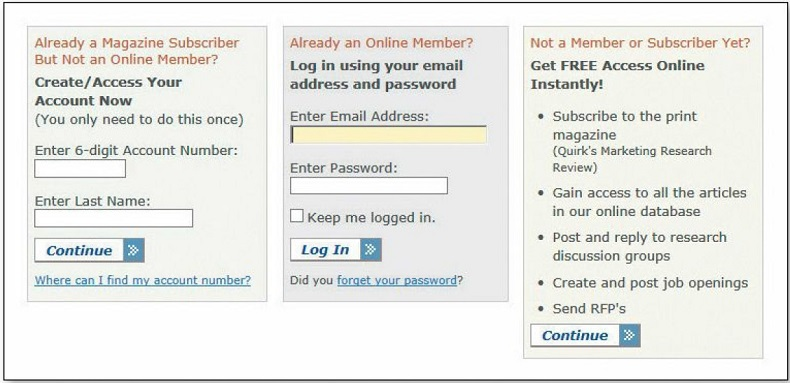
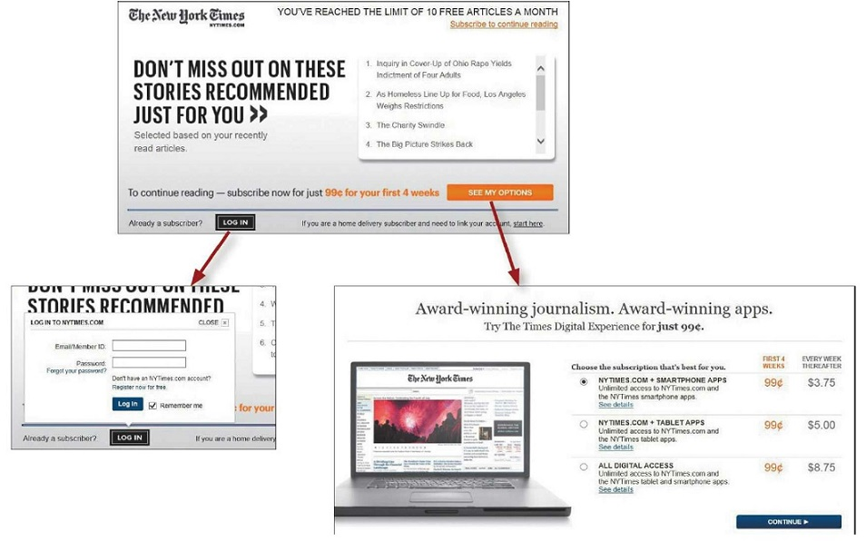
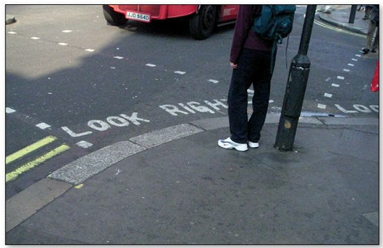

Web designers and usability professionals have spent a lot of time over the
years debating how many times you can expect users to click (or tap) to get
what they want without getting too frustrated. Some sites even have design
rules stating that it should never take more than a specified number of clicks
(usually three, four, or five) to get to any page in the site.

On the face of it, "number of clicks to get anywhere" seems like a useful
metric. But over time I've come to think that what really counts is not the
number of clicks it takes me to get to what I want (although there are limits),
but rather how hard each click is — the amount of thought required and the
amount of uncertainty about whether I'm making the right choice.

:::tip
I think the rule of thumb might be something like "three mindless,
unambiguous clicks equal one click that requires thought."
:::

:::info Animal,vegetable, or mineral?
The classic first question in the word game Twenty Questions—"Animal,
vegetable, or mineral?"—is a wonderful example of a mindless choice. As long as you accept the premise that anything that's not a plant or an animal — including things as diverse as pianos, limericks, and cheesecake, for instance — falls under "mineral", it requires almost no thought to answer the question correctly.
:::

## Example 1
I was trying to buy a product or service to use in my home office (like a printer, for instance), most of the manufacturers’ sites asked me to make a top-level choice like this:

Which one was me? I had to think about it, and even when I made my choice
I wasn't very confident it was the right one. In fact, what I had to look
forward to when the target page finally loaded was even more thinking to
figure out whether I was in the right place.

## Example 2
I'm trying to read an article online. The page I arrive at gives me all these
options:

Now I've got to scan all this text and work out whether I'm a subscriber but
not a member, or a member, or neither one. And then I’ll have to dig up the
account number or the password that I used or decide whether it’s worth
joining.

At this point, the question I’m asking myself is probably changing from
"How do I answer this question?" to "Just how interested am I in this
article?"

The New York Times makes the same kind of choice seem much easier by not
confronting you with all the details at once. Making an initial selection (to
log in or to see your options for subscribing) takes you to another screen
where you see only the relevant questions or information for that selection.

Life is complicated, though, and some choices really aren't simple.
When you can't avoid giving me a difficult choice, you need to go out of your way to give me as much guidance as I need—but no more.

This guidance works best when it's:

**Brief:** The smallest amount of information that will help me

**Timely:** Placed so I encounter it exactly when I need it

**Unavoidable:** Formatted in a way that ensures that I'll notice it

:::info
Utilize tips or little question mark icons adjacent to form fields, "What's this?" links, and even tool tips when guidance is needed.
:::

A just-in-time guidance is found on street corners throughout London. It's brief ("LOOK RIGHT" and an arrow pointing right), timely (you see it at the instant you need to be reminded), and unavoidable (you almost always glance down when you're stepping off a curb).

