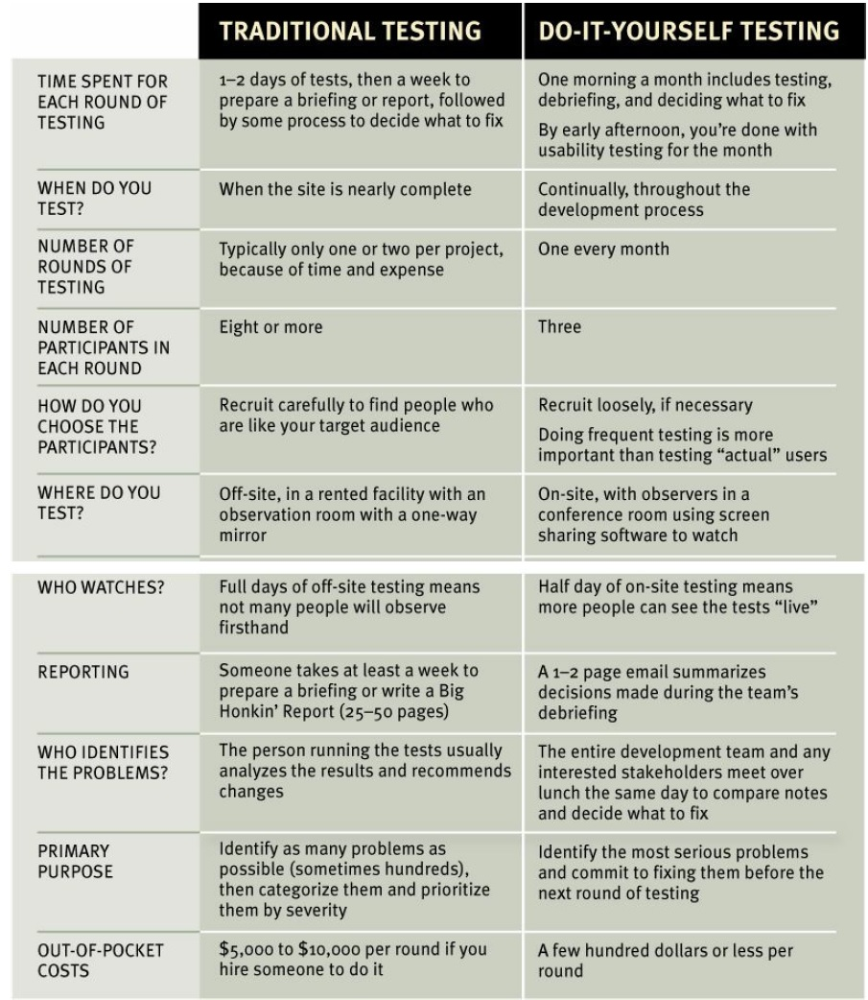

Usability testing is a method used to evaluate the usability and effectiveness of a product, such as a website, application, or physical device, by testing it with representative users. The primary goal of usability testing is to identify any usability issues, understand how users interact with the product, and gather feedback for improvements.

During a usability test, a moderator (aka facilitator) or researcher typically guides participants through a series of tasks while observing their behavior and collecting data. The participants are often representative of the target user group for the product. They may be asked to perform specific actions, provide feedback on their experience, or express their thoughts aloud as they navigate the product.

:::tip What Usability testing is NOT!
Usability testing is ***NOT***:

**A/B testing:** A/B testing is a statistical method of comparing and testing design variations to identify which the user prefers, and which changes improve performance. A/B testing is about preferences and provides only quantitative data, whereas usability testing is about behavior, and can provide both quantitative and qualitative data.

**Surveys:** Surveys can help you collect data from a large number of users or customers, typically in the form of multiple-choice questions, sentiment, or ratings. Surveys are great for understanding how users feel about a product, but don’t show you how they interact with it.

**Focus groups:** During a focus group, a moderator guides the discussion and asks open-ended questions to encourage participants to share their opinions and ideas. The goal is to gain insights into people's attitudes and experiences related to the topic.
:::

## Kinds of Usability Testing

The kind of test you want to run will help you choose the right usability testing method. A usability testing process can be either:

1. **Qualitative:** Qualitative usability testing focuses on the 'why'; understanding users' experiences, thoughts, and feelings while using a product. For example, you could conduct a think-aloud study where users verbalize their thoughts while using your product to complete usability tasks. Qualitative data can be gathered from observation, interviews, and surveys. 

    **five-second test**: participants are shown an image of a web page or mobile screen for, you guessed it, **five seconds** and then asked follow-up questions about what they just saw. Five-second testing aims to asses what users recall so you can ensure that your design communicates the right message to the right audience. There are two reasons why you should use 5-second tests:

    * *Check if the design communicates the right message:* when creating a new product, it can be hard to judge your design. For example, the messaging you use on a website can be clear to you but unclear to your audience. But a 5-second test can help you see if other people can understand the meaning of your design.
    * *Ensure that the design conveys a good impression:* website visitors only spend a few seconds assessing web design before deciding whether they want to stay or leave. That’s why conveying the right impression to your visitors during the first few seconds is essential.

2. **Quantitative:** Quantitative usability testing focuses on collecting and analyzing numerical data. A few popular usability testing metrics are:

    * **success rates:** what percentage of users succeed at completing the assigned task(s) successfully.
    * **task completion times:** how long it takes each user to complete each assigned task.
    * **error rates:** what percentage of users fail completely at completing the assigned task(s) successfully.
    * **satisfaction ratings:** what satisfication score (e.g, at scale of 1 to 10) each user gives to the product based on their experience on completing the assigned task(s).

From the collected data, you would then try to identify common patterns, generalize your findings, and make design changes.

## Truth about usability testing

1. **If you want a great site, you've got to test:** After you've worked on a site for even a few weeks, you can’t see it freshly anymore. You know too much. The only way to find out if it really works is to watch other
people try to use it.
2. **Testing one user is 100 percent better than testing none:** Testing always works, and even the worst test with the wrong user will show you important things you can do to improve your site.
3. **Testing one user early in the project is better than testing 50 near the end:** Most people assume that testing needs to be a big deal. But if you make it into a big deal, you won’t do it early enough or often enough to get the most out of it. A simple test early—while you still have time to use what you learn from it—is almost always more valuable than an elaborate test later.

## DIY Usability Testing

Usability testing has been around for a long time, and the basic idea is pretty
simple: If you want to know whether something is easy enough to use, watch some people while they try to use it and note where they run into problems.

The point of usability testing is to deliver a product focused on providing a positive user experience. Ideally, if you can afford, you would hire a professional to do the testing, but usability tesing does not have to be complicated and expensive. The following table gives a comparative view into traditional usability tesing (professionals conducting usability testing for you on a larger number of users) vs. DIY testing (you doing usability testing on your product on more limited number of users):

## How many users do you really need?

I think the ideal number of participants for each round of do-it-yourself
testing is three.

:::danger DIY Usability Testing is qualitative NOT quantitative
Proving things requires quantitative testing, with a large sample size, a clearly
defined and rigorously followed test protocol, and lots of data gathering
and analysis. Do-it-yourself tests are a qualitative method whose purpose is to
improve what you're building by identifying and fixing usability problems. The process isn't rigorous at all: You give them tasks to do, you observe, and you learn. The result is actionable insights, not proof.
:::

As with any other type of testing, you will not need to find all of the problems with usability testing. In fact, you'll never find all of the problems in anything you test.

:::tip 
Research (Virzi, 1992 and Neilsen Landauer, 1993) indicates that 5 users are enough to uncover 80% of usability problems. The truth is, the actual number of the user required depends on the complexity of the given application and your usability goals. Increase in usability participants results into increased cost , planning , participant management and data analysis.
:::

## How to Recruit Users?
When people decide to test, they often spend a lot of time trying to recruit
users who they think will precisely reflect their target audience — for instance,
"male accountants between the ages of 25 and 30 with one to three years of
computer experience who have recently purchased expensive shoes."

The truth though is that recruiting people who are from your target audience isn’t quite as important as it may seem. For many sites, you can do a lot of your testing with almost anybody. And if you’re just starting to do testing, your site probably has a number of usability flaws that will cause real problems for almost anyone you recruit.

:::info RECRUIT LOOSELY AND GRADE ON A CURVE
If you have plenty of time to spend on recruiting or you can afford to hire someone to do it for you, then by all means be as specific as you want. But if finding the ideal users means you're going to do less testing (or no testing at all!), then try to find users who reflect your audience, but don’t get hung up about it. Instead, loosen up your requirements and then make allowances for the differences between your participants and your audience. When somebody has a problem, ask yourself "Would our users have that problem, or was it only a problem because they didn't know what our users know?"
:::

## Where Do You Test?

Usability testing can be **in-person** or **remote**:

**In-person:** This is conducted in a physical location, usually a usability lab. This can be more expensive, time-consuming, and limiting in terms of sample size and geographic reach. In-person testing may be necessary for products that require safety considerations, supervision during use, or physical testing. 

**Remote:** This is done using online tools or software that allows users to share their screens, record their activity, and provide feedback. It's useful because your team and test participants can be based in entirely different locations.

## How Do You Choose the Tasks?

For each round of testing, you need to come up with tasks: the things the
participants will try to do.

The tasks you test in a given round will depend partly on what you have
available to test. If all you have is a rough sketch, for instance, the task may
consist of simply asking them to look at it and tell you what they think it is.

If you have more than a sketch to show them, though, start by making a list
of the tasks people need to be able to do with whatever you’re testing. For
instance, if you’re testing a prototype of a login process, the tasks might be

* Create an account
* Log in using an existing username and password
* Retrieve a forgotten password
* Retrieve a forgotten username
* Change answer to a security question
* Etc

## What to Do with Usability Testing Observations

After each round of tests, you should make time as soon as possible for the
team to share their observations and decide which problems to fix and what
you’re going to do to fix them.

:::danger First Things First
FOCUS RUTHLESSLY ON FIXING THE MOST SERIOUS PROBLEMS FIRST.
:::

Here's a method to make sure this happens:

* **Make a collective list:** No discussion at this point; Just make a comllective listing of all the problems observed. And they have to be observed problems; things that actually happened during one of the test sessions. 

* **Choose the ten most serious problems:** You can do informal voting, but you can usually start with the ones that got the most checkmarks.

* **Rate them:** Number each issue from 1 to 10, 1 being the worst. Then copy them to a new list with the worst at the top, leaving some room between them.

* **Create an ordered list:** Starting at the top, write down a rough idea of
how you’re going to fix each issue, who's going to do it, and any resources it will require. 
:::tip
You don't have to fix each problem perfectly or completely. You just have to do something—often just a tweak—that will take it out of the category of "serious problem."
:::
